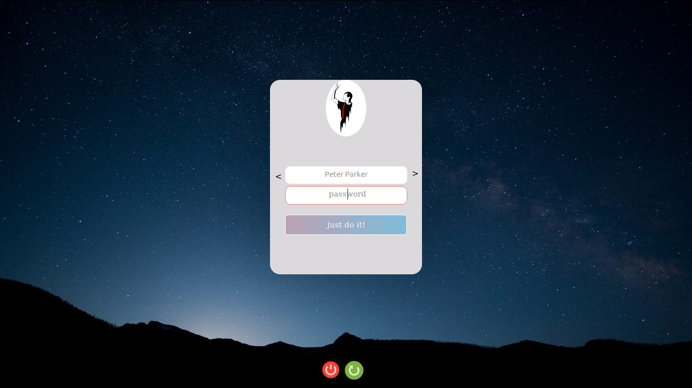
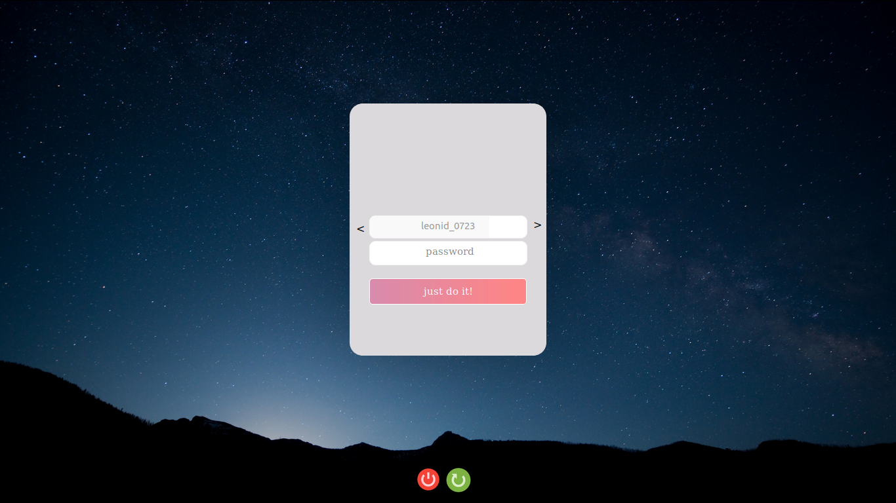

 

## Lightdm-SimpleDM
- animated Button!
- Support MultiAccount
- Button shutdown/reboot
- Minimalistic
- optimized
 
 

## Installation
Instructions will differ for every platform, but install it on `Xubuntu`
 
1. Install fonts for your system 
- Segoe UI : https://github.com/meloncholy/mt-stats-viewer/raw/master/public/fonts/segoe-ui/segoeui.ttf
- iosevka  : https://github.com/be5invis/Iosevka/releases/download/v2.0.1/01-iosevka-2.0.1.zip
2. Install and enable `lightdm` and `lightdm-webkit-greeter`
3. In the terminal, navigate to `/usr/share/lightdm-webkit/themes/`
4. Clone this repository here, it should create a folder called `lightdm-SimpleDM`
5. Enable the theme in your `/etc/lightdm/lightdm-webkit-greeter.conf`
6. Replace lightdm-gtk to lightdm-webkit in your `/usr/share/lightdm/lightdm.conf.d/60-lightdm-gtk-greeter.conf`
7. change line code `greeter-session=lightdm-gtk-greeter` to `greeter-session=lightdm-webkit-greeter`
 
 

## settings
1. You can change background. Check the /lightdm-SimpleDM/static/bg2.jpg

 
 

## Screenshot 

